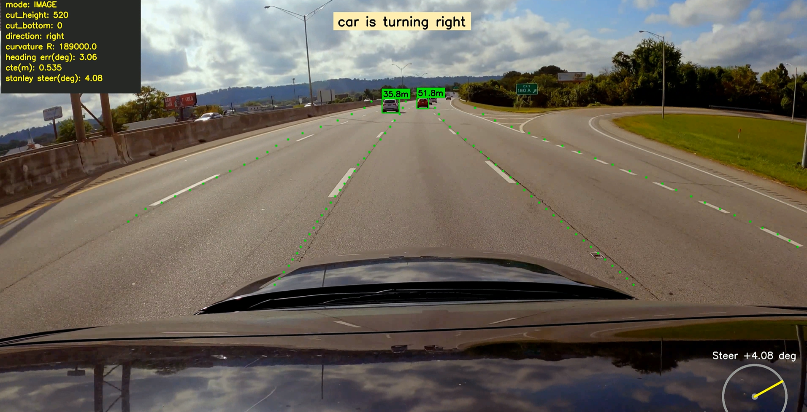
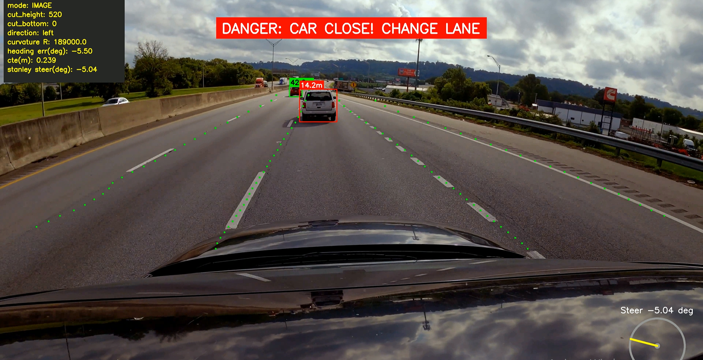

# UFLD-YOLO-ADAS

A computer vision based **Advanced Driver Assistance System (ADAS)** that combines **Ultra-Fast Lane Detection (UFLD)** and **YOLOv8** for dashcam video analysis.

This project detects road lanes, identifies nearby vehicles, estimates vehicle distance, analyzes driving direction, and generates safety warnings when vehicles are detected at critical distances.

---

## 📸 Demo Output



### ADAS Telemetry & Safety System



The output visualization includes:

- Lane detection
- Vehicle detection and tracking
- Distance estimation
- Driving direction analysis
- ADAS telemetry dashboard
- Collision warning alerts

---

# 🚗 Features

## Lane Detection

- Uses **Ultra-Fast Lane Detection (UFLD)** for lane extraction.
- Predicts lane points from dashcam frames.
- Processes lane coordinates for driving analysis.
- Removes vehicle bonnet region for cleaner visualization.

## Vehicle Detection & Tracking

- Uses **YOLOv8** for real-time vehicle detection.
- Detects and tracks road vehicles:
  - Cars
  - Trucks
  - Buses

## Distance Estimation

- Estimates distance between the ego vehicle and detected vehicles.
- Provides real-time distance measurements.
- Triggers warnings when vehicles are too close.

## Driving Direction Analysis

- Calculates lane position and steering information.
- Determines vehicle movement direction:

  - Left
  - Right
  - Straight

## ADAS Safety Warning System

- Monitors surrounding vehicles.
- Detects potential collision risks.
- Generates visual danger alerts.

## Real-Time Telemetry Dashboard

Displays driving information including:

- Steering angle
- Heading error
- Cross-track error (CTE)
- Vehicle direction
- Curvature estimation

---

# 🧠 Models Used

## Ultra-Fast Lane Detection (UFLD)

Used for detecting lane markings from dashcam frames.

**Configuration:**

- Backbone: ResNet-18
- Dataset: TuSimple
- Framework: PyTorch

## YOLOv8

Used for vehicle detection and tracking.

Detected vehicle classes:

- Cars
- Trucks
- Buses

---

# 🔄 Computer Vision Pipeline

```
Dashcam Video
        |
        ↓
Frame Extraction
        |
        ↓
UFLD Lane Detection
        |
        ↓
Lane Coordinate Extraction
        |
        ↓
YOLOv8 Vehicle Detection
        |
        ↓
Vehicle Tracking & Distance Estimation
        |
        ↓
Steering & Direction Analysis
        |
        ↓
ADAS Telemetry Generation
        |
        ↓
Safety Warnings + Output Video
```

---

# 🛠️ Technologies Used

- Python
- PyTorch
- CUDA
- OpenCV
- YOLOv8
- Ultra-Fast Lane Detection
- NumPy
- SciPy
- TorchVision
- Matplotlib

---

# ⚙️ Workflow

1. Clone the Ultra-Fast Lane Detection repository.
2. Install required dependencies.
3. Verify GPU and CUDA configuration.
4. Download pretrained UFLD weights.
5. Load the UFLD lane detection model.
6. Process dashcam video frames.
7. Extract lane coordinates.
8. Run YOLOv8 vehicle detection and tracking.
9. Estimate vehicle distance.
10. Calculate steering direction and lane position.
11. Generate final ADAS telemetry output.

---

# 🎥 Output

The final generated video contains:

✅ Detected lane points  
✅ Vehicle bounding boxes  
✅ Vehicle distance labels  
✅ Driving direction indicator  
✅ Steering wheel visualization  
✅ Telemetry dashboard  
✅ Collision warning system  

---


# 📚 References

- Ultra-Fast-Lane-Detection  
https://github.com/cfzd/Ultra-Fast-Lane-Detection

- Ultralytics YOLO  
https://github.com/ultralytics/ultralytics

---

# 👩‍💻 Author

**Ujala Basit**

Computer Vision | Machine Learning | Deep Learning | Artificial Intelligence
